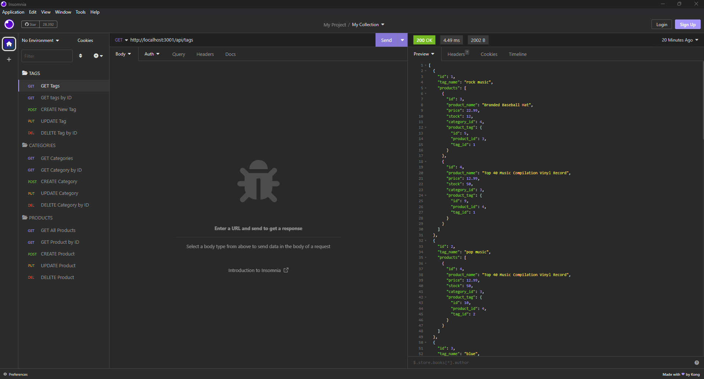
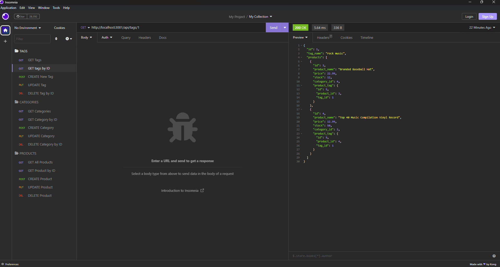
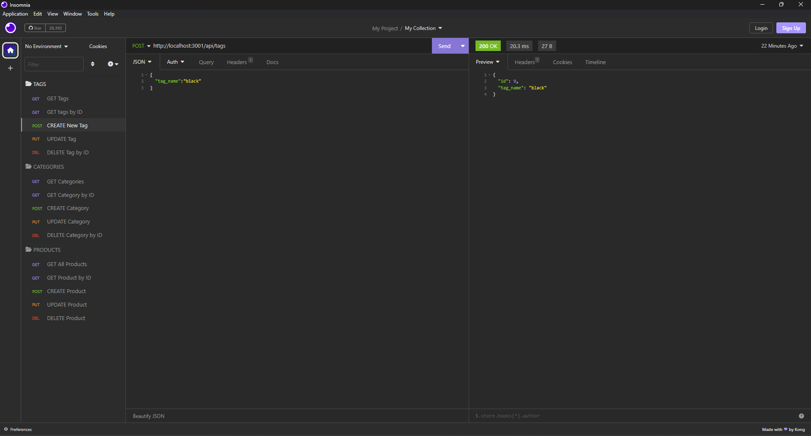
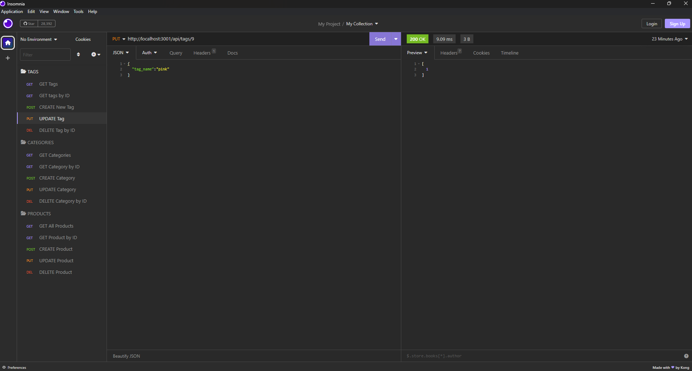
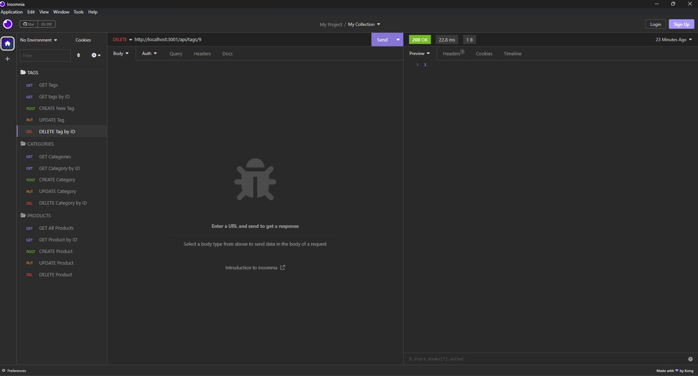

# E-Commerce-Backend

## Description

This project was made to create a back end of an E-Commerce store. This project uses, express, mysql2, sequelize and dotenv modules.

This project taught me how to create models with relations between each other. Creating routes for the tables to get, post, put and delete.

## Usage

This project is the back end server for an E-Commerce store. There are 5 routes per section, Category, Tags and Products.

Get All Products/Category/Tags  
Get Product/Category/Tags by ID  
Post Create new Product/Category/Tag  
Put Update Product/Category/Tag by ID  
Delete Product/Category/Tag by ID

These are Screenshots of the routes in insomnia

Walkthrough Video URL: https://youtu.be/fY_wpR1QEWY  
GitHub Repo: https://github.com/TimeBytes/E-Commerce-Backend

## Credit

Credit to University of Toronto for starter code  
https://github.com/coding-boot-camp/fantastic-umbrella

## License

MIT License
